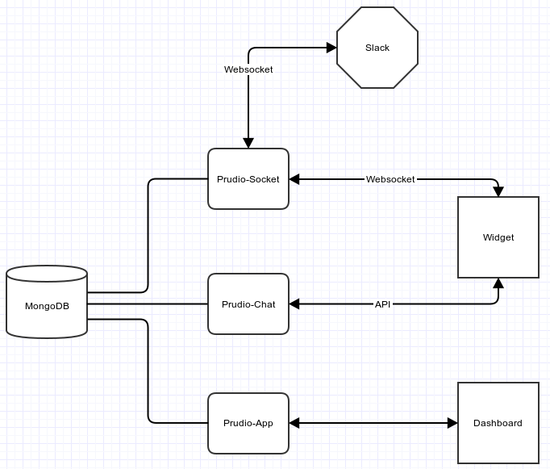

How to setup Prudio's development environment
=============================================

This document is divided into 3 steps and is intended for developers who what to improve `Prudio` using the [Àssembly platform](https://assembly.com). First we need to setup `prudio-app`, this repository is main backend of the project. The next step is to integrate the `prudio-chat` repo (the frontend widget which the users include into their websites) and finally take a look into the `prudio-socket`.

The final result should be something like this:

 

For this guide we expect you have the following software installed:

* [Node.js and npm](https://nodejs.org/)
* [MongoDB](https://www.mongodb.org/)
* [NVM (optional)](https://github.com/creationix/nvm)
* [Bower](http://bower.io/)
* [Gulp](http://gulpjs.com/) (Prudio-app)
* [Grunt](http://gruntjs.com/) (Prudio-chat)
* [Foreman](https://www.npmjs.com/package/foreman) (Prudio-chat)

If you already have `nodejs` and `npm` installed, installing bower and gulp is just 2 commands:

> sudo npm install -g bower

**then**

> sudo npm install -g gulp

**then**

> sudo npm install -g grunt-cli

**then**

> sudo npm install -g foreman

**and**

In this last step, if you are in a ubuntu machine you will need to install the package `nodejs-legacy` first.

> sudo npm install -g strongloop


After installing the above requirements, we can start setting up our development environment.

(optional) If you want to use nvm (whatever the reason) the following command will let you install and use different node versions (in this case `0.12.4`):

> nvm install 0.12.4 && nvm use 0.12.4

# Prudio-app

Now to setup this base repo you will need to fork it. Then clone it:

> git clone git@github.com:YOUR-USER/prudio-app.git

After moving on lets add the original repository as a remote, so we can easily keep ours updated:

> git remove add upstream git@github.com:asm-products/prudio-app.git

Now lets install the dependencies of the project:

> npm install

At this moment we are able to run the website (but we are not finished).

> slc run

And you should be able to visit:

* The API explorer: `http://localhost:3000/explorer/`
* The project dashboard: `http://localhost:3000/`

At this stage it is important to refer that you will need to run `gulp build` every time you make any changes to the angular.js code (frontend). If you want to do this automatically every-time you save a file, you can use: `gulp livereload`.

If you look at the console output you will notice that the line _Invalid access token_ is often being printed. This means the environment variables are not set. We will need at least one slack id and secret to make the dev environment fully functional.

To get the needed slack codes for your dev environment go to: `https://api.slack.com/` and create a new app. The only thing you should guarantee is that there is a: `http://localhost:3000/auth/slack` in the Redirect URI(s).

Those codes should be be loaded to the environment variables **SLACK_CLIENT_ID** and **SLACK_CLIENT_SECRET**. Like this:

> export SLACK_CLIENT_ID=XXX

> export SLACK_CLIENT_SECRET=YYY

> export SLACK_REDIRECT_URI=http://localhost:3000/auth/slack

We are done with this repository.

# Prudio-chat

Now we will setup the chat repository, which contains the code for the frontend widget that will be placed in the users websites and will connect to prudio's backend.

First fork and clone the repository to your local machine:

> git clone git@github.com:YOUR-USER/prudio-chat.git

After moving on lets add the original repository as a remote, so we can easily keep ours updated:

> git remove add upstream https://github.com/asm-products/prudio-chat

then lets install the required dependencies:

> npm install

then lets build the current project

> grunt build

Now we need to set our node environment to `local` and tell the app where is the mongo server, so the correct settings can be applied:

> export NODE_ENV=local

> export MONGOLAB_URI=mongodb://localhost:27017/

> export PORT=4000

then just launch a page with the client

> nf start

at the moment you will need to manually modifify the line

```
<script src="/client.local.js?appid=CHANGE-FOR-YOUR-OWN-APPID" async></script>
```

in `index.html` to use the `appid`'s you create in prudio's dashboard, but it will change soon.

At this point this repo is ready, just visit `http://localhost:4000/client-html` and you should see the widget.

# Prudio-socket

The final step in the process of setting up our development environment is to add the component that will connect to slack. Like the other repositories you will need to fork, clone and add an upstream remote.

> git clone git@github.com:YOUR-USER/prudio-socket.git

> git remote add upsream git@github.com:asm-products/prudio-socket.git

Now lets install the dependencies

> npm install

The code is ready, but we need a few more tweaks. First lets add some environment variables:

> export MONGOLAB_URI=mongodb://localhost:27017/

> export SERVER=LOCAL

Now add the information about the sockets server to the database:

> mongo

> db.Servers.insert({"active" : true, "name" : "prudio-local", "server" : "LOCAL", "address" : "http://localhost", "port" : 5000,})

And we should be able to run it:

> nf start

At this moment we have 3 servers running and you should be able to use everything without issues.